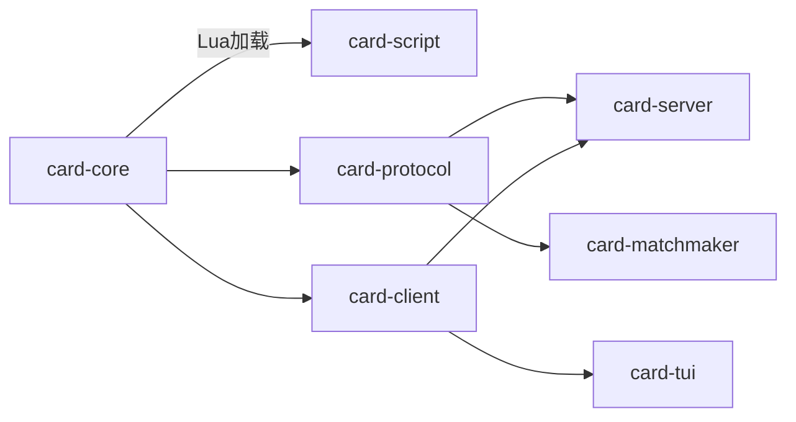

# 联网卡牌对战系统架构设计文档

## 第1章 项目概述

### 1.1 项目目标

本项目目标是构建一个商业级、可扩展、可维护的联网卡牌对战系统。
系统以双人对战为核心场景，强调规则一致性、网络稳定性、可回放性、可扩展性与跨端接入能力。
架构层面坚持“核心逻辑与外部输入输出分离”的原则，使规则演进不被界面或网络实现耦合。

### 1.2 核心特性

- Rust 引擎：负责完整规则执行、状态推进与事件生成。
- Lua 脚本：描述卡片定义与效果数据，不直接执行游戏逻辑。
- P2P TCP：对战阶段由玩家主机与客机直连通信。
- TUI 客户端：提供终端交互式体验，支持快速调试与低资源运行。
- 回放与存档：支持完整重放与中途快照恢复。
- 匹配服务器：提供独立的联网匹配与版本检查能力。

### 1.3 设计边界

系统不建设中心化对战计算服务器。
游戏规则执行只发生在本局主机上的游戏引擎中。
匹配服务器只承担会话撮合与版本校验，不参与战局判定。

### 1.4 成功标准

- 规则层：卡组构建、阶段推进、效果触发、连锁解算全部可验证。
- 网络层：断线、超时、重连策略可配置且日志可追踪。
- 工程层：模块职责清晰，crate 间依赖单向可控。
- 产品层：支持本地对战、远程对战、回放、存档与后续多客户端扩展。

## 第2章 整体架构

### 2.1 架构分层说明

整体采用“核心引擎层 + 脚本适配层 + 协议层 + 服务层 + 客户端层 + 匹配层”的模块化设计。
核心引擎层仅处理规则。
协议层定义网络消息与可见状态边界。
服务层处理会话与传输。
客户端层实现具体交互体验。
匹配层独立部署。

### 2.2 crate 依赖关系图



### 2.3 card-core 职责

card-core 是游戏引擎核心。
它是纯逻辑库，不依赖网络、终端、文件等 IO。
主要能力包括：

- 统一类型定义：卡片、玩家、区域、阶段、事件、命令。
- 效果系统 AST：描述 Trigger、Condition、Action、Modifier。
- 规则校验：卡组合法性、费用支付合法性、目标选择合法性。
- GameState：唯一可信状态源，支持命令驱动状态迁移。

### 2.4 card-script 职责

card-script 负责 Lua 集成与脚本装载：

- 加载脚本文件并建立沙盒。
- 限制可用标准库，禁止脚本做系统调用。
- 将 Lua table 解析为 Rust 的 CardDefinition。
- 产出可被 card-core 消费的强类型定义对象。

### 2.5 card-protocol 职责

card-protocol 定义跨进程、跨网络边界使用的消息协议：

- Command：玩家意图，表示操作请求。
- GameEvent：引擎确认后的事实事件。
- NetworkMessage：传输封包，承载命令、事件、握手、心跳等。
- VisibleGameState：面向客户端的可见状态，保障信息隔离。

### 2.6 card-client 职责

card-client 提供统一客户端抽象接口：

- 定义 ClientApi trait，规范输入输出交互。
- 封装状态渲染所需的数据投影。
- 屏蔽具体界面技术差异，支撑多前端实现。

### 2.7 card-server 职责

card-server 负责对战会话管理与网络服务：

- GameSession 生命周期管理。
- TCP 服务端连接处理、消息接收与分发。
- 命令转发到引擎并广播事件。
- 回放录制、快照存档、恢复流程编排。

### 2.8 card-tui 职责

card-tui 是终端客户端实现：

- 使用 ratatui + crossterm 构建交互界面。
- 呈现手牌、区域、阶段、提示、连锁窗口。
- 接收用户输入并转为标准 Command。

### 2.9 card-matchmaker 职责

card-matchmaker 是独立匹配服务：

- 维护在线队列并完成玩家匹配。
- 执行版本检查，避免协议不兼容。
- 返回对战连接信息，不处理局内逻辑。

## 第3章 核心设计原则

### 3.1 纯逻辑引擎

card-core 只处理规则，不依赖任何 IO。
任何状态变更都由输入命令触发，并通过事件输出。
该原则保证规则可测试、可重放、可复现。

### 3.2 Command/Event 模式

系统主链路如下：

1. 客户端提交 Command。
2. 引擎进行合法性校验。
3. 引擎推进状态并生成 GameEvent。
4. 服务层广播事件并更新可见状态。

此模式统一了“操作请求”与“事实结果”的语义边界。

### 3.3 Lua 声明式脚本

Lua 负责表达卡片定义与效果结构。
Rust 负责解析、校验与执行。
脚本不可直接改变引擎状态，避免不可控副作用。

### 3.4 客户端抽象

通过 ClientApi trait，系统可无缝支持 TUI、Bevy、Web、Unity 等实现。
界面层只消费可见状态与事件，不侵入规则层。

### 3.5 可配置规则

每局对战均可配置 GameRules：

- 初始 HP 与上限。
- 卡组上下限。
- 单操作响应超时。
- 单局总时间上限。
- 其他扩展规则开关。

该设计支持赛事规则、娱乐规则与测试规则并行。

## 第4章 游戏规则

### 4.1 卡组构建

- 每位玩家卡组数量为 40 到 60 张。
- 同名卡最多 3 张。
- 传奇卡最多 5 张。
- 游戏人数固定为 2 人。

### 4.2 七个游戏阶段

阶段顺序固定如下：

1. 回合开始。
2. 抽卡阶段。
3. 回收阶段。
4. 主要阶段 1。
5. 战斗阶段。
6. 主要阶段 2。
7. 回合结束。

阶段切换由引擎统一推进，并通过事件通知客户端。

### 4.3 玩家区域定义

- Deck：卡组区。
- Hand：手卡区，上限 20。
- ForEnd：前场区，5 格。
- BackEnd：后场区，5 格。
- CostZone：费用区，上限 6。
- Grave：墓地区。
- HP：生命值，初始 5，上限 6。
- RealPoint：真实点数，上限 6。

### 4.4 费用系统

费用系统是本游戏最核心的资源机制之一：

- 支付费用时，将手卡放入费用区。
- 费用可用 RealPoint 按比例替代。
- 已在费用区的卡仍可被使用。
- 费用区中的卡再次登场前仍占位。
- 费用区达到上限后，无法继续用“手卡入费用区”方式支付。

### 4.5 战斗系统

战斗规则摘要：

- 仅前场人物卡可发起攻击。
- 对手前场有卡时，默认必须先攻击对方前场。
- 比较攻击力，高者存活，低者进墓地。
- 攻击力相同则双方进入墓地。
- 发起方在战斗结算后获得 1 点 RealPoint。

直接攻击补充：

- 若攻击方 RealPoint 为 0，则先获得 1 点。
- 若攻击方 RealPoint 大于 0，可消耗 n 点对对手造成 n 点伤害。
- 当受击方血量不足以承担伤害时，必须使用 RealPoint 抵减。

### 4.6 回收系统

回收阶段从费用区回收卡到手卡。
回收数量 X 等于“对手前场最高费用卡”的费用。

- 若 X 大于费用区现有数量，则全部回收。
- 若 X 小于现有数量，当前玩家选择恰好 X 张回收。
- 若 X 为 0，则不回收。

### 4.7 游戏内限制与溢出事件

- 手卡上限 20，超出部分新加入卡进入墓地或弃牌区。
- 费用区上限 6。
- RealPoint 上限 6。
- RealPoint 达上限后继续获得会触发溢出事件。

溢出事件属于可被效果系统监听的事件源。

### 4.8 规则补充

- 初始手牌为 5。
- 先手第一回合不抽卡。
- 传奇卡可放置于前场或后场。

## 第5章 效果系统架构

### 5.1 效果系统目标

效果系统用于表达卡片在不同时点、不同条件下可执行的游戏行为。
系统以 AST 形式建模，便于组合、验证、序列化与跨端显示。

### 5.2 Effect 结构

```text
Effect {
  trigger（时点），optional（是否可选），activation_limit（次数限制），
  conditions（条件AST），choices（目标选择），actions（动作列表），costs（发动费用）
}
```

字段说明：

- trigger：效果触发入口。
- optional：是否允许玩家选择不发动。
- activation_limit：限制发动频率与范围。
- conditions：发动前必须满足的逻辑条件。
- choices：需要玩家做出的目标选择。
- actions：实际执行的状态变更动作。
- costs：额外发动成本。

### 5.3 触发时点 Trigger

阶段触发：

- TurnStart
- DrawPhase
- RecoveryPhase
- OwnMainPhase
- OpponentMainPhase
- BothMainPhase
- BattlePhase
- TurnEnd

动作触发：

- OnSummon
- OnAttack
- OnExpose
- OnDestroy

事件触发：

- OnEvent(EventTrigger)

### 5.4 条件 AST（Condition）

条件表达使用组合语义：

- And：逻辑与。
- Or：逻辑或。
- Not：逻辑非。
- Compare：数值或关系比较。
- CardIsOnField：指定卡是否在场。

该结构支持复杂条件的可视化与可执行化。

### 5.5 动作 Action

支持动作包括：

- Draw
- Damage
- Destroy
- SummonFromZone
- ReturnToHand
- SendToGrave
- ModifyAttack
- GainRealPoint
- HealHp
- Discard
- ApplyModifier
- RemoveModifier
- Special

所有动作最终在引擎事务内执行，保证一致性。

### 5.6 修饰器 Modifier

修饰器用于持续或条件性改变卡片行为：

- 攻击力增减。
- 免疫卡类型。
- 免疫属性。
- 免疫破坏。
- 免疫指定。
- 允许直接攻击。
- 额外攻击次数。
- 禁止攻击。
- Special 扩展修饰。

### 5.7 规格示例映射

示例一：登场时不支付费用召唤特定卡。

- trigger：OnSummon
- conditions：目标卡可被召唤
- actions：SummonFromZone

示例二：攻击时攻击力 +200。

- trigger：OnAttack
- actions：ModifyAttack

示例三：在场时己方其他卡攻击力 +100。

- trigger：持续态或事件态
- actions：ApplyModifier

示例四：不受策略卡影响。

- modifier：ImmuneToCardType

示例五：对手 RealPoint 增加时可返回手卡。

- trigger：OnEvent(EventTrigger)
- conditions：CardIsOnField
- actions：ReturnToHand

## 第6章 连锁解算系统

### 6.1 连锁设计目标

连锁系统用于处理多方响应式效果的先后关系。
核心要求是可预测、可复盘、可日志追踪。

### 6.2 FILO 栈模型

连锁采用后进先出（FILO）解算。
后加入栈的效果先解算，确保响应优先级直观。

### 6.3 连锁权交换流程

```text
当前玩家发动效果 → 加入连锁栈
→ 连锁权交给对手 → 对手选择是否连锁
→ 对手Pass → 权利返回当前玩家 → 当前玩家Pass
→ 双方都Pass → 开始从栈顶解算（FILO）
```

流程关键点：

- 任一方超时可视为 Pass。
- 双方连续 Pass 才进入结算阶段。
- 结算期间默认不再主动发动新效果，除非规则允许的被动插入。

### 6.4 瞬时卡处理

瞬时策略卡发动后立即计算效果。
该动作完成后，连锁权立即交给对手。
这一机制强化了“快速响应”与“对手反制窗口”。

### 6.5 被动效果插栈

连锁解算过程中触发的被动效果会立即插入栈顶。
插栈后继续按 FILO 规则推进。
该能力保证事件触发链路完整。

## 第7章 网络架构

### 7.1 P2P TCP 架构说明

对战采用 P2P TCP 架构，不使用中心服务器进行局内计算。
主机负责监听端口并承载引擎执行。
客机连接主机后参与同一会话。

### 7.2 RemoteClient 代理模型

RemoteClient 将远程玩家消息转为本地命令语义：

- 接收 TCP 消息。
- 解析为 Command。
- 交给服务层统一处理。

此模型让本地玩家与远程玩家在引擎入口保持一致。

### 7.3 命令同步机制

命令同步主链路：

1. 主机接收玩家 Command。
2. 引擎执行并生成 GameEvent。
3. 事件封装为 NetworkMessage::EventNotification。
4. 广播给所有客户端。
5. 客户端渲染 VisibleGameState。

VisibleGameState 必须隐藏对方手牌与私密信息。

### 7.4 匹配服务器定位

card-matchmaker 为独立服务，采用 WebSocket 协议。
其职责仅包括：

- 玩家匹配。
- 版本检查。

其不参与任何效果系统、连锁、伤害、胜负等规则计算。

## 第8章 回放与存档

### 8.1 回放系统

回放由“初始状态 + 命令序列”构成：

- 录制：保存初始 GameState 与完整 Command 序列。
- 重放：按原始顺序重演命令。
- 校验：重放最终状态需与原局最终状态一致。

该机制可用于观战、复盘、争议裁定与回归测试。

### 8.2 快照存档（残局系统）

存档面向中途暂停与恢复：

- 保存：将当前 GameState 序列化为 JSON 快照。
- 恢复：从 JSON 反序列化并继续对局。

快照可附带元信息：回合数、阶段、时间预算、随机种子。

### 8.3 一致性要求

- 存档恢复后状态必须与保存时严格一致。
- 回放与实时执行必须产生一致事件序列。
- 协议版本变化需要兼容策略或迁移工具。

## 第9章 技术选型

| 组件 | 选型 | 理由 |
|------|------|------|
| 核心语言 | Rust Edition 2024 | 性能、安全、类型系统 |
| Lua 集成 | mlua 0.11（lua54, serialize, vendored） | 无系统Lua依赖，支持序列化 |
| 异步运行时 | tokio（full） | 高性能异步IO |
| 网络序列化 | serde + bincode 1.x | 高效二进制，适合wire format |
| 存档格式 | serde + serde_json | 人类可读，适合持久化 |
| TUI | ratatui 0.29 + crossterm 0.28 | 跨平台TUI框架 |
| 日志 | tracing + tracing-subscriber | 结构化日志 |
| 错误处理 | thiserror（库）+ anyhow（应用） | 分层错误处理 |
| 随机数 | rand + rand_chacha | 确定性随机（洗牌/AI） |
| 匹配服务器 | tokio-tungstenite | WebSocket支持 |
| 时间戳 | chrono | 回放/日志时间戳 |

### 9.1 选型落地原则

- 引擎层优先确定性与可测试性。
- 网络层优先吞吐与可追踪性。
- 客户端层优先跨平台与演进空间。
- 存储层优先可读性与兼容性平衡。

## 第10章 安全与约束

### 10.1 unsafe 使用边界

unsafe 只允许在 card-script 的 Lua API 加载层使用。
其他模块默认禁用 unsafe。
该策略降低全局内存安全风险。

### 10.2 Lua 沙盒策略

Lua 运行环境应使用白名单标准库。
通过 Lua::new_with(StdLib whitelist) 禁用 IO、网络与系统调用。
脚本仅可声明数据，不可访问主机资源。

### 10.3 超时机制

系统支持双重超时：

- 单操作响应超时。
- 单局总时间超时。

两类超时均可在对局前配置，超时默认判负。

### 10.4 资源上限

- 手卡上限：20。
- 费用区上限：6。
- RealPoint 上限：6。

达到上限后的行为必须由规则显式定义并记录日志。

### 10.5 审计与可观测性

关键流程必须具备结构化日志：

- 命令接收与拒绝原因。
- 事件生成与广播。
- 连锁入栈与出栈。
- 超时触发与判负路径。
- 回放校验与存档恢复结果。

在问题定位时，日志应可还原关键决策链路。

## 附录A 术语对照

- 效果系统：卡片效果的结构化表达与执行机制。
- 连锁：多方响应效果按栈规则解算的流程。
- P2P：玩家节点直接通信，不依赖中心战局服务器。
- 可见状态：对客户端暴露的裁剪状态视图。
- 溢出事件：资源达到上限后继续增加时触发的事件。

## 附录B 扩展方向

- 增加回放压缩与快速跳转。
- 增加断线重连与会话恢复令牌。
- 增加规则模板市场与赛事预设。
- 增加效果文本多语言生成器。
- 增加 AI 对战与训练模式。

本架构文档用于统一工程实现方向。
后续若规则演进，以 card-core 的类型与协议变更为主线同步更新文档。
